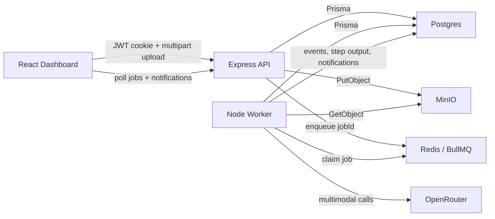
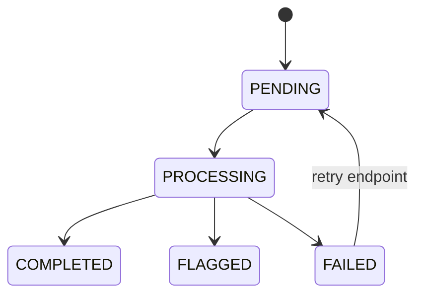

# Image Pipeline

AI media processing microservice built as a Turborepo with:

- `apps/web`: React + Vite dashboard
- `apps/api`: Express + TypeScript API
- `apps/worker`: BullMQ worker
- `packages/core`: shared pipeline, schema, and provider logic
- Postgres + Prisma for source-of-truth state
- Redis + BullMQ for work delivery
- MinIO for local S3-compatible object storage
- OpenRouter for multimodal model calls with structured JSON output
- JWT cookie auth
- OpenAPI docs
- Vitest test suites

The API accepts an image upload, stores the file first, creates a durable job record, enqueues `{ jobId }`, and returns immediately. The worker performs captioning, label detection, and content safety checks in order.

## Architecture



Short version:

- Browser uploads image to API
- API stores file in MinIO, writes durable job state to Postgres, and enqueues `jobId` in Redis
- Worker pulls `jobId`, reads the image, runs caption -> labels -> safety through OpenRouter
- Worker writes step results, events, and final status back to Postgres
- Browser polls API and shows live job progress

## Core Behavior

`POST /api/jobs` does all of the following without calling any AI model:

1. Authenticates the user
2. Validates JPG/PNG/WEBP, max 5MB, and matching image file signatures
3. Stores the image in MinIO
4. Creates `MediaJob` with `PENDING`
5. Creates ordered `JobStep` rows:
   - `IMAGE_CAPTIONING`
   - `LABEL_DETECTION`
   - `CONTENT_SAFETY`
6. Emits job events
7. Enqueues a BullMQ job with only `{ jobId }`
8. Returns immediately with `{ jobId, status: "PENDING" }`

The worker then executes the pipeline sequentially:

```txt
IMAGE_CAPTIONING -> LABEL_DETECTION -> CONTENT_SAFETY
```

Completed steps are reusable on retry. Redis is only delivery infrastructure. Postgres remains the source of truth.
The content-safety step uses a SafeSearch-compatible likelihood enum contract so the worker can make a deterministic flagging decision even when the underlying model provider is OpenRouter.

## Services

`docker compose up --build` starts:

- `web` on `http://localhost:8080`
- `api` on `http://localhost:3001`
- `worker`
- `postgres` on `localhost:5432`
- `redis` on `localhost:6379`
- `minio` on `http://localhost:9000`
- MinIO console on `http://localhost:9001`

OpenAPI docs are available at:

- `http://localhost:3001/api/docs`
- `http://localhost:3001/api/docs/openapi.json`

## Local Setup

### Prerequisites

- Node 22+
- `pnpm`
- Docker Desktop or a compatible Docker engine

### Install

```bash
pnpm install
```

### Run in development

```bash
pnpm dev
```

This starts `postgres`, `redis`, and `minio` in Docker, then runs:

- Vite on `http://localhost:5173`
- API on `http://localhost:3001`
- Worker in watch mode

### Run the full container stack

```bash
docker compose up --build
```

The browser app talks to the API through nginx on `/api` in container mode.

## Environment Variables

For local development, the only real external key you need is `OPENROUTER_API_KEY`.
The other values in the example env files are already set up to work with the local Docker stack, so you can usually keep them as-is.

### API

See [`apps/api/.env.example`](./apps/api/.env.example).

Important values:

- `API_HOST`
- `PORT`
- `DATABASE_URL`
- `REDIS_URL`
- `MINIO_ENDPOINT`
- `MINIO_PORT`
- `MINIO_ACCESS_KEY`
- `MINIO_SECRET_KEY`
- `MINIO_BUCKET`
- `MINIO_USE_SSL`
- `JWT_SECRET`
- `AUTH_RATE_LIMIT_MAX`
- `AUTH_RATE_LIMIT_WINDOW_MS`
- `UPLOAD_RATE_LIMIT_MAX`
- `UPLOAD_RATE_LIMIT_WINDOW_MS`

### Worker

See [`apps/worker/.env.example`](./apps/worker/.env.example).

Important values:

- `DATABASE_URL`
- `REDIS_URL`
- `MINIO_ENDPOINT`
- `MINIO_PORT`
- `MINIO_ACCESS_KEY`
- `MINIO_SECRET_KEY`
- `MINIO_USE_SSL`
- `OPENROUTER_API_KEY`
- `OPENROUTER_CAPTION_MODEL`
- `OPENROUTER_LABEL_MODEL`
- `OPENROUTER_SAFETY_MODEL`

## AI Provider Choice

Add an OpenRouter API key to the worker environment:

```env
OPENROUTER_API_KEY=your_key_here
OPENROUTER_CAPTION_MODEL=openrouter/free
OPENROUTER_LABEL_MODEL=openrouter/free
OPENROUTER_SAFETY_MODEL=nvidia/nemotron-3.5-content-safety:free
```

The default env uses `openrouter/free` for captioning and labels because it is a free router. That keeps setup cheap, but free upstream providers can fail or rate-limit more often. The worker already does automatic retries, and failed jobs can also be retried from the UI.

For a more reliable low-cost setup, this model mix worked better in practice:

```env
OPENROUTER_CAPTION_MODEL=qwen/qwen3.7-plus
OPENROUTER_LABEL_MODEL=qwen/qwen3.7-plus
OPENROUTER_SAFETY_MODEL=nvidia/nemotron-3.5-content-safety:free
```

If the worker starts without `OPENROUTER_API_KEY`, the stack still boots, but media jobs will fail with a clear configuration error until the key is set.

For safety, the worker asks the model to return structured JSON with SafeSearch-style likelihood values:

```txt
UNKNOWN
VERY_UNLIKELY
UNLIKELY
POSSIBLE
LIKELY
VERY_LIKELY
```

Any category rated `LIKELY` or `VERY_LIKELY` marks the image as flagged.

## Upload Protection

The API enforces upload rules before a job is created:

- Auth is required
- File size is limited to 5MB through `multer`
- Only JPG, PNG, and WEBP MIME types are accepted
- The file bytes must match the declared image type
- Uploads are rate limited at the API layer

The local rate limiter is intentionally process-local so the assignment stack remains easy to run with `docker compose up`. At production scale, I would move this boundary to a distributed limiter such as Unkey, with per-user and per-IP quotas.

## Decisions

Open-ended architecture decisions are documented in [`decisions.md`](./decisions.md).

## Auth Choice

Authentication uses JWTs stored in an HttpOnly cookie.

Why this choice:

- Simple browser auth flow
- No token storage in localStorage
- Works well with same-origin container deployment
- Keeps the frontend implementation small and understandable

Seeded local account:

- Email: `admin@example.com`
- Password: `password123`

## Queue Choice

BullMQ + Redis is used for delivery and worker coordination.

Why this choice:

- Lightweight operational footprint
- Good fit for ordered background jobs
- Clear separation between delivery and durable state
- Easy local development with Docker Compose
- Supports built-in automatic retry and exponential backoff without moving durable state out of Postgres

## Storage Choice

MinIO provides local S3-compatible object storage.

Why this choice:

- Same object-storage pattern you would use with S3
- Easy local development
- Simple migration path to managed S3 later

Images are served back through the API at `/api/jobs/:jobId/image`, which avoids leaking internal MinIO container hostnames to the browser.

## Polling Choice

The frontend polls active jobs every 2.5 seconds and notifications every 5 seconds.

Why this choice:

- Very small implementation surface
- Reliable in local and container deployments
- Easy to replace with SSE or WebSockets later if needed

The job detail screen renders activity as a scrollable event timeline. New events animate into the timeline as polling refreshes the job state, so reviewers can see the worker progress without refreshing the page.

## Observability

The API and worker use structured JSON logs so local debugging and production log shipping stay straightforward.

What is logged:

- API startup events
- Per-request API logs with method, path, status code, duration, and `x-request-id`
- API error logs with request context
- Worker job start, completion, and failure events
- Provider request metadata, including upstream request ids when available

The API returns an `x-request-id` header on every response. If a request fails, the same request id is included in the error response body so a reviewer or operator can correlate browser failures with server logs quickly.

Operational visibility is also available through:

- `GET /api/health` for app and database health
- `JobEvent` rows for append-only pipeline history
- `JobStep` rows for per-step output, attempts, and failure state

## Data Model

### `User`

- Identity
- Password hash
- One-to-many jobs
- One-to-many notifications

### `MediaJob`

- Original file metadata
- Storage location
- Pipeline status
- Final caption
- Final labels JSON
- Final safety result JSON including SafeSearch-compatible likelihood ratings
- Flagging fields
- Retry metadata
- Timestamps

### `JobStep`

- Ordered pipeline step rows
- Per-step status
- Attempt counter
- Stored output JSON
- Stored error JSON

### `JobEvent`

- Append-only timeline for job activity
- Includes create, queue, start, step, retry, completion, flagging, and failure events

### `Notification`

- In-app user notifications
- Read tracking
- Optional structured payload

The Prisma schema lives at [`apps/api/prisma/schema.prisma`](./apps/api/prisma/schema.prisma).

## State Machine



Meaning of final states:

- `COMPLETED`: Pipeline finished and content was safe
- `FLAGGED`: Pipeline finished and content was unsafe
- `FAILED`: Pipeline execution failed

`FLAGGED` is a successful pipeline run with an unsafe result, not an execution error.

## Retry Behavior

BullMQ performs automatic retries with exponential backoff for worker failures.

Retry semantics:

- Automatic retries reuse the same BullMQ job up to `maxAttempts`
- Intermediate failed attempts do not finalize the job as `FAILED`
- Completed steps stay completed across retries
- A failed step can be re-entered on the next worker attempt
- Once `maxAttempts` is exhausted, the job becomes `FAILED`
- `POST /api/jobs/:jobId/retry` is available only after final failure
- Manual retry resets `attempts` back to `0`, clears the terminal failure fields, and appends `JOB_RETRIED`

## API Surface

- `POST /api/auth/signup`
- `POST /api/auth/login`
- `GET /api/auth/me`
- `POST /api/auth/logout`
- `POST /api/jobs`
- `GET /api/jobs`
- `GET /api/jobs/:jobId`
- `GET /api/jobs/:jobId/image`
- `POST /api/jobs/:jobId/retry`
- `GET /api/notifications`
- `POST /api/notifications/:id/read`
- `GET /api/health`
- `GET /api/docs`

All job and notification routes require auth. Users can only access their own records.
The OpenAPI document includes request bodies, multipart upload documentation, security schemes, response schemas, and error payloads.

## Frontend

The dashboard includes:

- Production-style login and signup
- Image upload
- Job list
- Per-job status
- Retry button for failed jobs
- Distinct styling for flagged jobs
- Detail page with image preview, caption, labels, safety result, step output, retry attempts, and animated timeline

## Tests

Run everything:

```bash
pnpm test
```

Covered behavior includes:

- Upload validation
- Image signature validation
- Structured OpenRouter JSON parsing
- Sequential step ordering
- Completed step reuse
- Failed job retry behavior
- Retryable-attempt behavior before terminal failure
- Safe job completion
- Unsafe job flagging
- Retry restriction to failed jobs
- User ownership boundary on job access

The shared pipeline tests use in-memory fakes rather than real OpenRouter calls.

## CI/CD

This repository includes a GitHub Actions workflow at [`ci.yml`](./.github/workflows/ci.yml).

The workflow runs:

- `pnpm install --frozen-lockfile`
- `pnpm check`
- `pnpm test`
- `pnpm build`

For deployment, the intended path is to ship the same service split used locally:

- `web` as a static site behind nginx or a frontend host
- `api` as a containerized Node service
- `worker` as a separate containerized Node service
- Postgres, Redis, and S3-compatible storage as managed infrastructure

This repo includes a DigitalOcean helper at [`scripts/deploy-digitalocean.sh`](./scripts/deploy-digitalocean.sh). It creates or reuses a droplet, copies the repository, writes production environment values, and starts the production compose stack from [`deploy/docker-compose.prod.yml`](./deploy/docker-compose.prod.yml).

## Known Limitations

- The frontend uses polling instead of push updates
- Large-scale object lifecycle management is not included
- The current rate limiter is process-local and intended for this assignment scale
- Virus scanning and EXIF stripping are not included
- The local MinIO deployment is single-node
- The current free OpenRouter label model can still produce low-value labels on some images

## 10x Scaling Discussion

If this service needed to handle materially more throughput, the next improvements would be:

1. Run multiple worker replicas with queue concurrency tuned by model latency and provider limits
2. Move MinIO to managed S3 and serve media through signed CDN-backed delivery
3. Replace the in-process limiter with a distributed rate-limit service such as Unkey and add per-user quotas
4. Partition hot job queries with purpose-built indexes and read replicas
5. Replace polling with SSE or WebSockets for active job updates
6. Add dead-letter handling and operator retry tooling around BullMQ
7. Cache duplicate uploads by `sha256` and reuse prior outputs when allowed by product policy
8. Split notifications and analytics into dedicated pipelines if write volume grows
9. Add per-tenant concurrency controls so one heavy user cannot monopolize worker throughput
10. Add object lifecycle rules, archival, and automated cleanup for old raw uploads
11. Add malware scanning, EXIF stripping, and optional image normalization before AI processing
12. Push queue, worker, and provider metrics into a real observability backend with alerting

## Workspace Commands

```bash
pnpm dev
pnpm build
pnpm check
pnpm test
```
